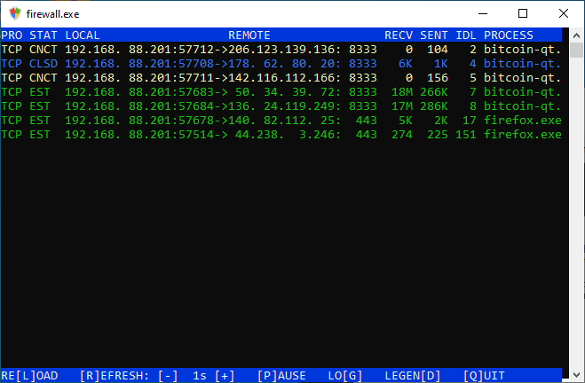

# firewall.exe v0.93

## Requirements:

  [WinDivert 2.2](https://www.reqrypt.org/windivert.html) (included)\
  [Microsoft Visual C++ Redistributable for Visual Studio 2015, 2017 and 2019 (x86)](https://aka.ms/vs/16/release/vc_redist.x86.exe) (download)

## Instruction

1. Edit settings

* settings.txt

2. Edit firewall rule tables

* loopback.txt (Loopback rules)
* out.txt (Outbound rules)
* in.txt (Inbound rules)

Rules are executed in sequential order. \
The sequence is terminated on a match, \
with one of the following actions: \
\
  ACCEPT      - accept the connection and show activity \
  ACCEPT_HIDE - accept the connection but hide activity \
  REJECT      - reject the connection with TCP RST \
  DROP        - drops the packet silently \
\
If no match is found, the default is DROP. \
\
\# precedes a comment \
\* represents a wildcard \
IP Subnets are allowed in CIDR format eg. 192.168.0.0/24

3. Run firewall.exe as Administrator

## Known Limitations

* Ports are not validated and treated as strings. "001" not equals "1"
* Invalid action defaults to DROP
* Only supports TCP and UDP. IPv6, ICMP and other protocols are dropped

## Changes

### v0.93

* Added settings
* Added logging mode
* Added colours to UI
* Added mutex to socket and network handles
* Added disable Windows Firewall on startup
* Added restore Windows Firewall on close
* Added legend
* Fixed display issues
* Added action REJECT

### v0.92

* Fixed minor memory leak
* Added reload
* Added refresh interval
* Added pause refresh
* Added quit

## Upcoming

* More clean up
* Windows GUI
* Run as Windows Service
* Stress Testing
* Fix stability issue under extreme load
* Performance Tuning
  * enums instead of strings
  * switch (enum)
  * store ip addresses and subnet masks in binary